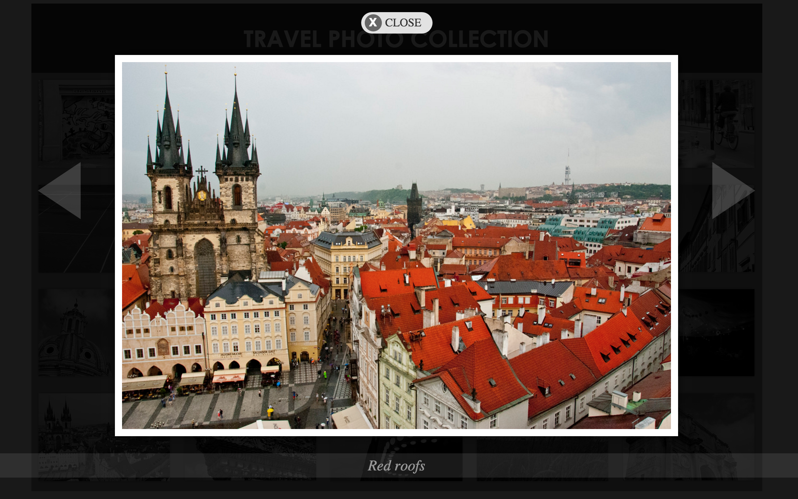

# Flickr_Project

The goals of this project:

* Use pure Javascript
* Access data using Flickr API
* Display image data on a lightbox view

## Main Page

## Lightbox View

# Technology Stack

* Javascript
* CSS
* HTML

The project is hosted on [heroku](https://radiant-ridge-3805.herokuapp.com/).
The source code is located on [github](https://github.com/xyedagun/Flickr_Project).

